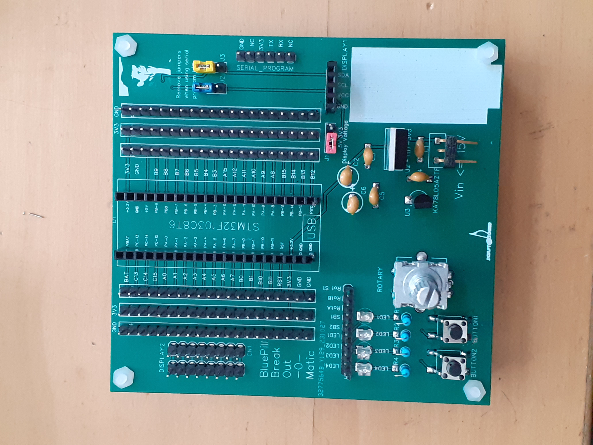
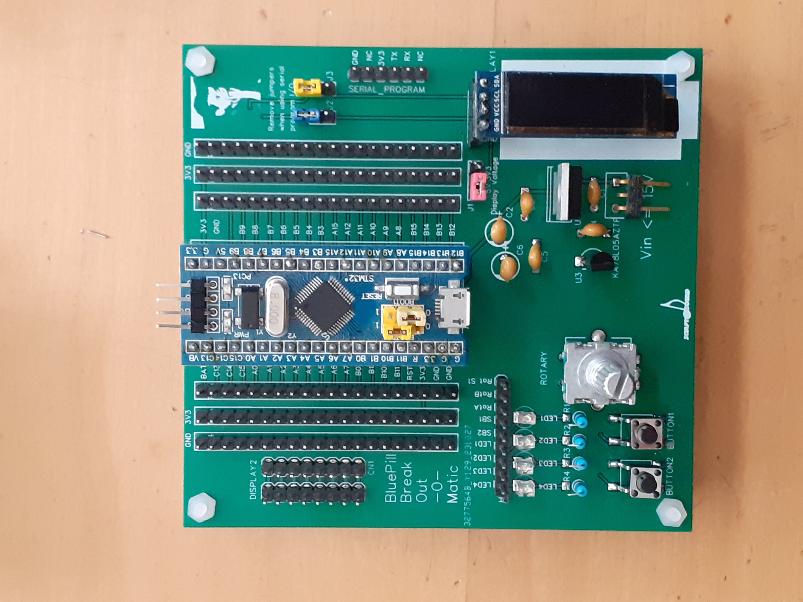
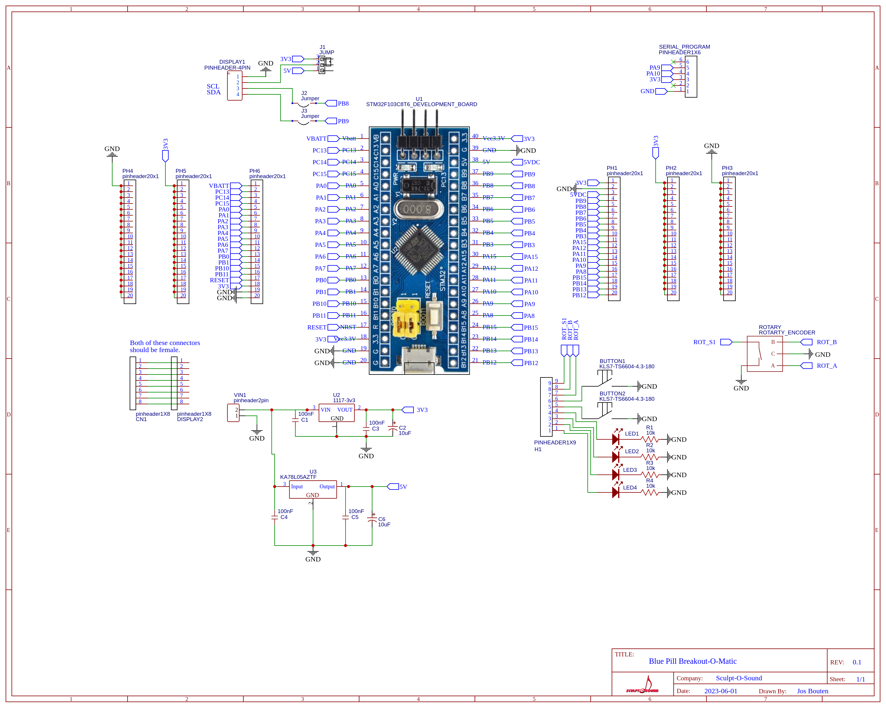

BluePill-Breakout-O-Matic
-
This is a breakout board I designed for use with the STM32 Blue Pill.
When experimenting with electronics on a bread board and a BluePill I found using the BluePill development board tedious because the peripherals were always dangling about and this made for an unclear situation.
So I designed the breakout board. It can be used to experiment with buttons, LEDs, LCD displays, a rotary encoder and more. The pin connectors can be used to hook up
other peripherals using Dupont cables or similar.
It has a 3V3 power regulator to power the BluePill and a 5V power regulator for peripherals like an OLED display.
The programming of the BluePill I usually do via a serial adapter connected to pin A9 and A10.
You can find these pins on the RHS of the PCB and you can use the jumpers J3 to disconnect A9 and A10 from the
serial programming interface in case you want to use them for other purposes.

The DISPLAY1 (SPI) and DISPLAY2 (free format) connectors can be used to connect e.g. OLED displays. 
But of course you are free to use them otherwise. You can set the DISPLAY1 voltage to 3.3V or 5V using jumper J1.
The LEDs will light up when a HIGH is applied to them.  The relatively high serial resistor prevents you from being blinded by them.
The buttons switch to gnd. 

Board and jumpers

Board and some LEDs, buttons, a rotary encoder and an OLED LCD-display.

Schematic

